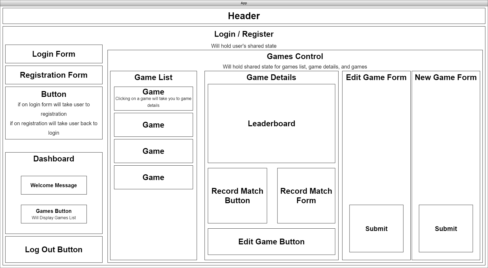

# Joshua Khan

# The Dojo(TBD)

**_A videogame ranking and leaderboard website for games that don't have one built in or if you want a private leaderboard_**

## MVP:
* User registration and sign in.
* Log matches and change ranking based on results.
* Leaderboards to display users rankings.
* Game Library. users should be able to look up and add games to the library and each game should have it's own rankings and leaderboard.

## MVP Technologies: 
### Language:
TypeScript
### Libraries:
* React
* Redux Toolkit
* React-Redux
### Database/Authentication:
* Firebase

## Stretch Goals:
* ELO based ranking
* User created tournaments with an invite and/or sign-up system
* Animated Backgrounds
* Forums
* Secure Login with JWT

## Stretch Goal Technologies:
* Aseprite

## Component Diagram

